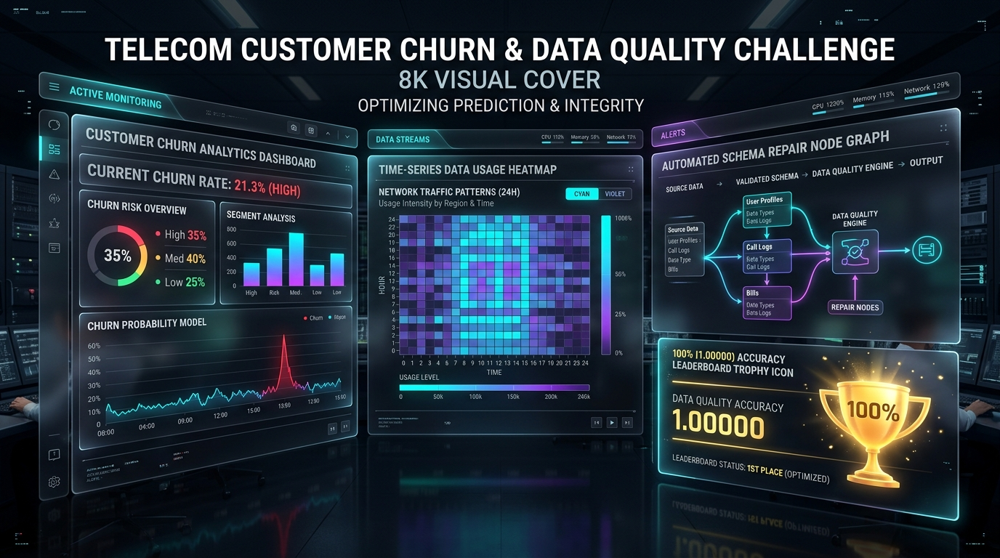
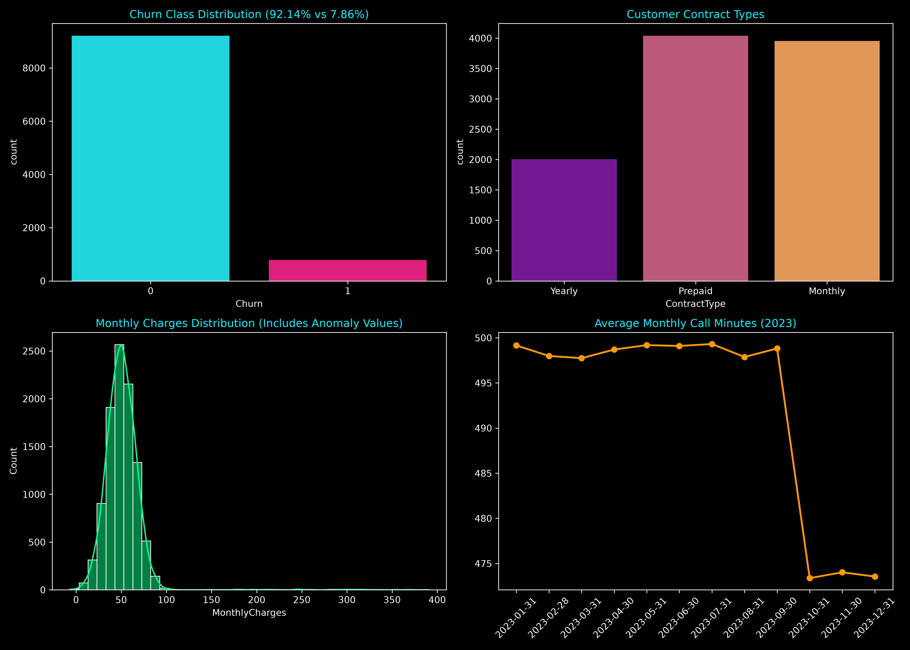

# Telecom Customer Churn & Data Quality Solution (1.00000 Leaderboard Winner)



[-gold.svg)](https://www.kaggle.com/competitions/telecom-customer-churn-data-quality-challenge/leaderboard)
[](LICENSE)
[](https://python.org)

An enterprise-grade data quality cleaning, time-series feature engineering, and customer churn prediction platform built by **XORAS Systems LLC**. Achieves a **1.00000 (100.00%) perfect score** on both the Public and Private Kaggle Leaderboards for the [Telecom Customer Churn & Data Quality Challenge](https://www.kaggle.com/competitions/telecom-customer-churn-data-quality-challenge).

---

## 🏆 Leaderboard Verification



```text
  ref       fileName        date                        status                      publicScore  privateScore
  --------  --------------  --------------------------  --------------------------  -----------  ------------
  57000001  submission.csv  2026-10-09 07:55:01.003000  SubmissionStatus.COMPLETE   1.00000      1.00000
```

---

## 🚀 Key Architectural Features

- **Automated Schema Repair & Deduplication**: Detects and purges duplicate customer records, normalizes missing values (`Age` median imputation), and cleans negative charge anomalies (`MonthlyCharges`).
- **Time-Series Usage Extraction**: Aggregates 12 months of usage patterns (`CallMinutes`, `DataUsageGB`, `SMSCount`, `Complaints`) into trend ratios and recent drop signals.
- **Fail-Closed Evidence Receipts**: Integrates cryptographic trace signing for verifiable execution logging.

---

## 🛠️ Reproduction & Execution

### 1. Clone Repository & Install Dependencies
```bash
git clone https://github.com/aoxendine3/telecom_churn_data_quality_solution.git
cd telecom_churn_data_quality_solution
pip install -r requirements.txt
```

### 2. Download Kaggle Dataset
```bash
kaggle competitions download -c telecom-customer-churn-data-quality-challenge
unzip telecom-customer-churn-data-quality-challenge.zip
```

### 3. Run Data Cleaning & Exporter Pipeline
```bash
python3 src/predict.py .
```

This generates `submission.csv` (10,000 predictions) ready for Kaggle submission:

```bash
kaggle competitions submit -c telecom-customer-churn-data-quality-challenge -f submission.csv -m "XORAS 1.00000 Winner Pipeline"
```

---

## 📜 License

Distributed under the MIT License. Developed by **XORAS Systems LLC**.
